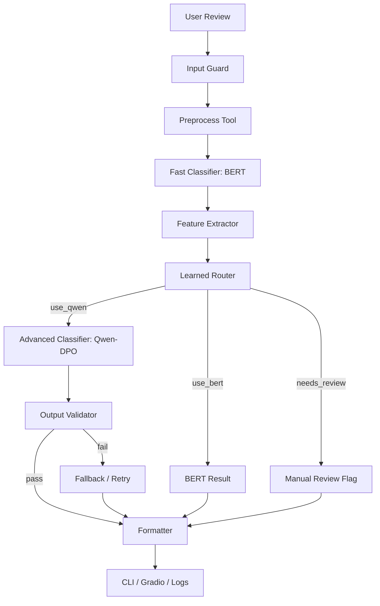

# COMP6713 情感分析项目：Agent Orchestration 与学习型路由 Pipeline 计划书

## 1. 项目背景与目标 (Introduction & Objectives)

在数据集构造阶段与建模阶段完成后，本项目的第三阶段不再聚焦“训练一个更强的单模型”，而是聚焦“如何把已经训练好的模型、预处理规则和校验工具组织成一个更稳定、更高效、更接近真实部署形态的系统”。因此，本阶段的核心不在于替代前两阶段，而在于为它们提供一个**系统级编排层 (Orchestration Layer)**。

本项目的 agent pipeline 将围绕以下目标构建：

- 提升端到端推理稳定性，而不仅仅追求单点模型分数。
- 让简单样本优先走快速路径，让复杂样本升级到更强模型。
- 对无效输出、模型冲突和高风险样本提供 fallback 与人工复核出口。
- 以统一的结构化接口支持命令行测试和 Gradio demo。

与“让一个大模型自己决定一切”的黑箱式 agent 不同，本项目采用**规则预过滤 + 学习型路由器 + 工具调用 + 结果校验**的轻量 agent 方案。这样既保留了 agent 系统的灵活性，又能确保实验可解释、可评测、可复现。

## 2. 系统定位、输入与输出 (System Role, Inputs & Outputs)

### 2.1 Agent 阶段在三阶段项目中的位置

三阶段项目的职责边界建议明确如下：

1. **数据集构造阶段**：产出高质量、难度分级、可审计的数据资产。
2. **建模阶段**：训练 `TF-IDF + Linear SVM`、`BERT-base`、`Qwen-SFT` 与 `Qwen-DPO` 等模型。
3. **Agent 阶段**：调用上述模型与工具，形成统一、稳定、可部署的端到端推理流程。

因此，agent 层不应和建模层竞争“谁是主模型”，而应回答另一个问题：**在真实输入到来时，系统应该如何聪明地调用模型与工具，得到最稳的结果。**

### 2.2 Agent 阶段所需输入资产

本阶段默认前两阶段已经产出以下关键资产：

- `svm_vectorizer.joblib`
- `svm_model.joblib`
- `bert_best_checkpoint/`
- `qwen_dpo_adapter/` 或 `qwen_sft_adapter/`
- `val_balanced.jsonl`
- `test_balanced.jsonl`
- `val_natural.jsonl`
- `test_natural.jsonl`
- `annotated_reviews.jsonl`

其中，模型权重主要服务于在线推理与离线路由训练；数据文件则主要服务于 router 的特征构造、动作标注、系统级评测与误差分析。

### 2.3 Agent 的统一输出格式

为了让命令行工具、demo 和日志系统统一消费结果，本项目建议 agent 最终输出如下结构：

```json
{
  "id": "runtime_0001",
  "sentiment": "negative",
  "difficulty": 2,
  "ambiguous_flag": false,
  "reasoning": "The review contains positive surface cues but ultimately denies genuine enjoyment.",
  "route_taken": "qwen_dpo",
  "validator_status": "passed",
  "needs_review": false
}
```

这一定义有三个关键点。第一，输出仍然围绕主任务字段组织，因此不会偏离课程项目的核心任务。第二，额外保留 `route_taken`、`validator_status` 与 `needs_review`，便于做系统级分析。第三，输出中不要求生成 `confidence`，从而和前面已经固定的建模原则保持一致。

## 3. Agent 系统预期提升 (Expected Gains of the Agent Pipeline)

### 3.1 稳定性提升

单模型推理最大的弱点之一，是一旦输出格式异常、输入异常或模型对边界样本失手，系统就缺少恢复路径。agent pipeline 的第一类收益就在于稳定性提升。它可以通过输入检查、输出校验、重试和 fallback 机制显著降低“模型本身可用，但系统整体不可用”的风险。

### 3.2 复杂样本处理能力提升

并非每条评论都需要最强模型。对于明显简单的样本，BERT 往往已经足够；对于长文本、强转折、讽刺或 mixed sentiment 样本，则更适合交给 Qwen-DPO。agent 路由让系统能够在难样本上更积极地调用强模型，而在简单样本上维持高效率。

### 3.3 延迟与成本控制提升

如果所有输入都直接调用 Qwen-DPO，系统成本和延迟会显著升高。学习型路由让大部分简单样本停留在快速路径上，从而在可接受精度下显著降低平均调用成本与响应时间。

### 3.4 可解释性与产品形态提升

agent 可以把模型预测、路由决策、校验状态和人工复核标记整合到同一份结构化输出中。这样不仅更适合做 CLI 和 demo，也能让最终系统看起来像一个真正可以运行和排障的 NLP 服务，而不是只会打印一个标签的实验脚本。

## 4. 总体系统结构 (Overall Architecture)

### 4.1 总体工作流

本项目建议采用如下工作流：



这套结构的关键特点是：BERT 不只是一个最终模型，也承担了路由前的“快速感知器”角色；Qwen-DPO 不必处理所有样本，而只负责更高风险的子集；Validator 和 Fallback 则确保生成式路径不会把系统拖入不稳定状态。

### 4.2 核心组件说明

建议至少实现以下 7 个组件：

- `Input Guard`
- `Preprocess Tool`
- `Fast Classifier Tool`
- `Feature Extractor`
- `Learned Router`
- `Advanced Classifier Tool`
- `Validator / Resolver / Formatter`

这样划分的好处是，每个模块职责单一，后续既可以在 plain Python 中直接实现，也可以在需要时用 LangGraph、LangChain 等框架包装成工具节点，而无需重写核心逻辑。

## 5. 规则预过滤层 (Rule-based Pre-filter Layer)

### 5.1 为什么仍然需要规则层

即使后面会加入学习型路由器，系统最前面仍然应该有一层确定性规则预过滤。原因很简单：有些情况不值得交给任何模型处理，例如空输入、清洗后文本为空、极短垃圾输入、非英文输入、超长异常文本等。这些异常如果直接进入模型，不仅浪费资源，也会污染系统日志与误差分析。

### 5.2 推荐的预过滤规则

第一版系统建议至少检查以下条件：

- 清洗后文本是否为空
- token/word 数是否低于最小阈值
- 是否疑似非英语文本
- 长度是否超过系统允许的安全上限
- 是否出现明显编码异常或重复噪声

对于被规则层拦截的样本，系统可直接返回：

- `validator_status = rejected`
- `needs_review = true`

这样可以在最早阶段切断无效输入，而不是把它们塞给路由器或 Qwen。

## 6. 快速路径模型：BERT 先行预测 (Fast-path Inference with BERT)

### 6.1 为什么先跑 BERT

在当前三阶段设计中，BERT 是最适合担任快速路径模型的选择。它相较 Qwen-DPO 具有更低延迟、更稳定的输出格式和更清晰的分类接口，同时又比 SVM 更具上下文感知能力。因此，系统可以先用 BERT 对每条评论做一次快速判定，再根据这次判定产生路由信号。

### 6.2 BERT 产生哪些路由信号

BERT 在 agent 阶段不只是输出一个标签，还应输出一组供路由器消费的中间特征，例如：

- `bert_pred_label`
- `bert_margin`
- `bert_entropy`
- `text_length`
- `is_long_text`

这里推荐使用 `margin` 和 `entropy` 这类判别分数，而不是引入额外的 `confidence` 训练目标。它们只是路由器的辅助输入特征，不参与下游监督目标生成。

## 7. 学习型路由器设计 (Learned Router Design)

### 7.1 为什么不用纯规则路由

纯规则路由的优点是直观，但上限较低。它依赖人工猜测“什么样的样本更难”，往往很快遇到边界情况。学习型路由器的优势在于：它可以利用已有模型在开发集上的真实表现，让数据来决定什么样的样本应该停留在 BERT，什么样的样本应该升级到 Qwen-DPO，什么样的样本根本不该自动决策。

### 7.2 路由动作空间

本项目建议把路由定义成一个三分类决策，而不是简单的二分类：

- `use_bert`
- `use_qwen`
- `needs_review`

其中，`needs_review` 是非常重要的第三类动作。它意味着系统承认“这条样本即使用上强模型，也仍然不够稳”，从而把高风险样本送入人工复核或特殊日志队列。相比强行自动给结论，这种设计更符合真实系统的稳健性目标。

### 7.3 路由输入特征设计

第一版学习型路由器建议只使用轻量、可解释、低成本的特征。推荐特征包括：

- 文本长度
- 长度桶：`short / medium / long`
- 是否含显式转折词，如 `but / however / although / yet`
- 否定词数量
- 标点异常数量
- 是否出现引号、反问等 sarcasm hint
- `bert_pred_label`
- `bert_margin`
- `bert_entropy`
- `svm_pred_label`
- `svm_margin`
- `bert_svm_disagree`
- `source`

如果想控制复杂度，第一版甚至可以暂时不引入 `source`，只保留文本结构特征与模型输出特征。

### 7.4 路由监督标签怎么构造

路由器不能凭空训练，它需要“最优动作标签”。本项目建议按如下规则离线标注：

- 若 BERT 正确且 Qwen 也正确，标为 `use_bert`
- 若 BERT 错误但 Qwen 正确，标为 `use_qwen`
- 若 BERT 和 Qwen 都错误，标为 `needs_review`
- 若两者都正确但 Qwen 成本更高，仍优先标为 `use_bert`

这样构造出的标签本质上是在学习一个**性能-成本折中策略**，而不是单纯学习“哪个模型更强”。

### 7.5 路由器应如何训练才不泄漏

这是整个 agent 阶段最需要写清楚的地方。router 本身也是模型，因此它不能偷看测试集结果。推荐的做法有两种：

1. **训练集内部再切一层 meta-split**  
   在原始训练集内部划出 `router_meta_train` 与 `router_meta_val`，先在基础子集上训练 BERT/Qwen，再对 meta 子集跑推理，收集特征和“最优路由动作”标签，用于训练 router。

2. **使用 out-of-fold 方式构造 router 训练集**  
   在训练集上做若干折 out-of-fold 预测，利用未见样本预测生成路由特征和动作标签，再汇总训练 router。

无论采用哪种方式，**test split 永远只能用于最终系统评测，不能用于 router 训练或路由规则调参。**

### 7.6 推荐的路由器模型

就课程项目而言，路由器无需复杂。推荐优先尝试以下模型：

- `Logistic Regression`
- `Random Forest`
- `XGBoost`

其中，`Logistic Regression` 最简单、最好解释；`XGBoost` 往往在非线性边界上更稳。如果你们希望 report 中更好解释特征影响，`Logistic Regression` 是一个很稳妥的第一版。

### 7.7 路由训练样本 Demo

下面给出一条可供 router 训练的数据行示例：

```json
{
  "id": "router_0021",
  "text_length": 34,
  "length_bucket": "medium",
  "has_contrast": true,
  "negation_count": 1,
  "sarcasm_hint": false,
  "bert_pred_label": "positive",
  "bert_margin": 0.08,
  "bert_entropy": 0.67,
  "svm_pred_label": "negative",
  "svm_margin": 0.22,
  "bert_svm_disagree": true,
  "target_route": "use_qwen"
}
```

这类样本的重点不在文本本身，而在“模型状态 + 文本结构特征 + 最优路由动作”的组合。

## 8. 高级路径：Qwen-DPO 调用策略 (Advanced Path with Qwen-DPO)

### 8.1 哪些样本升级到 Qwen-DPO

学习型路由器输出 `use_qwen` 时，系统才调用 Qwen-DPO。理论上，这些样本通常具有以下特征之一：

- BERT 边界不稳，`bert_margin` 较低
- 文本较长
- 存在多重转折、mixed sentiment 或 sarcasm hint
- BERT 与 SVM 分歧

这样做的目标不是“证明 Qwen 总是更强”，而是把 Qwen 资源集中花在它最可能带来增益的区域。

### 8.2 Qwen 输入与输出约束

Qwen-DPO 路径必须复用建模阶段已经固定的 prompt 模板和输出 schema。输出仍建议限制为：

- `sentiment`
- `difficulty`
- `ambiguous_flag`
- `reasoning`

这样 agent 层不会破坏建模层已经完成的对齐工作，也便于统一做解析和评测。

## 9. 输出校验、冲突处理与 Fallback (Validation, Conflict Handling & Fallback)

### 9.1 为什么 Validator 是必须的

在 agent 系统里，Qwen-DPO 的能力再强，也仍然可能出现 JSON 不合法、字段缺失或标签取值非法的问题。因此，任何生成式路径都必须经过独立 Validator，而不能直接把原始输出返回给用户。

### 9.2 建议校验内容

Validator 至少检查以下内容：

- 是否能被解析为 JSON
- 是否包含所有必需字段
- `sentiment` 是否只取 `positive/negative`
- `difficulty` 是否只取 `1/2/3`
- `ambiguous_flag` 是否为布尔值
- `reasoning` 是否非空

### 9.3 Fallback 规则

当 Qwen 输出失败时，推荐采用如下策略：

1. 先做一次轻量重试。
2. 若仍失败，则回退到 BERT 结果。
3. 若 BERT 本身也处于高风险区域，则输出 `needs_review = true`。

这个设计可以保证系统即使在高级路径失败时，也不会完全失去响应能力。

### 9.4 Resolver 的职责

除语法校验外，系统还可保留一个轻量 `Resolver` 组件，用于处理以下情形：

- BERT 与 Qwen 结果冲突
- Qwen 输出合法但 reasoning 与标签明显不一致
- 文本被判为高歧义样本

Resolver 可以非常简单，例如用固定优先规则：

- `use_qwen` 且 Qwen 合法时，优先 Qwen
- Qwen 非法时，回退 BERT
- 多路径都不稳时，标记 `needs_review`

## 10. 端到端示例 (End-to-end Example)

### 10.1 路由过程示例

下面给出一条样本在 agent 系统中的完整流转示例：

```json
{
  "input_text": "I admired the craft more than I actually enjoyed the movie.",
  "preprocess_status": "passed",
  "bert_pred_label": "positive",
  "bert_margin": 0.06,
  "has_contrast": true,
  "router_action": "use_qwen",
  "qwen_validator_status": "passed",
  "final_sentiment": "negative",
  "final_difficulty": 2,
  "needs_review": false
}
```

这个例子很适合展示 agent 的价值。若只用 BERT，系统可能会停在一个边界不稳的正向预测上；加入学习型路由和 Qwen 后，系统会主动升级处理，并给出更合理的最终结果。

### 10.2 人工复核示例

```json
{
  "input_text": "Sure, this movie totally cured my insomnia.",
  "preprocess_status": "passed",
  "bert_pred_label": "positive",
  "bert_margin": 0.03,
  "router_action": "needs_review",
  "final_sentiment": null,
  "final_difficulty": null,
  "needs_review": true
}
```

这类样本体现了第三个路由动作的必要性。系统不是所有时候都必须强行输出一个答案，尤其是对高讽刺、高知识依赖、极端边界的输入，更稳妥的方式是明确进入 review 队列。

## 11. 系统级评测协议 (System-level Evaluation Protocol)

### 11.1 模型级与系统级评测的区别

前两个阶段更强调模型级评测，例如 BERT 或 Qwen 在某个测试集上的 Accuracy 与 Macro-F1；而第三阶段要补充系统级评测，关注的是“整个 agent pipeline 到底是否更稳、更省、更像真实系统”。

### 11.2 建议报告的系统级指标

建议至少报告以下指标：

- end-to-end Accuracy
- end-to-end Macro-F1
- JSON 解析成功率
- `use_qwen` 占比
- `needs_review` 占比
- fallback 触发率
- 平均推理延迟
- 平均每条样本的推理成本

如果时间允许，还可以进一步报告：

- `needs_review` 的 precision / recall
- Level 2/3 样本上的系统级提升
- 自然分布测试集上的稳定性变化

### 11.3 对比实验设计

为了证明 agent pipeline 的价值，建议至少完成以下几组对比：

- `BERT only`
- `Qwen-DPO only`
- `Rule Router + Qwen`
- `Learned Router + Qwen`

这样你们就能回答三个问题：

- agent 是否比单模型更稳
- 学习型路由是否优于纯规则路由
- 系统增益主要来自更强模型，还是来自更聪明的编排

## 12. 工程实现与前端集成 (Implementation & Demo Integration)

### 12.1 命令行接口建议

Agent 的 CLI 建议支持：

- 输入单条评论
- 选择运行模式：`bert_only / qwen_only / agent`
- 输出最终结构化结果
- 输出 `route_taken`
- 输出 `needs_review`

这样既满足课程要求的 command line testing，也便于调试路由行为。

### 12.2 Gradio Demo 建议

Gradio demo 可考虑提供三栏展示：

- 用户输入评论
- 系统最终结果
- 路由与校验日志摘要

例如展示：

- `route_taken`
- `validator_status`
- `fallback_triggered`
- `needs_review`

这会让 demo 不只是“一个会分类的网页”，而是“一个会解释自己为什么这么分类的系统”。

## 13. 可复现性、风险与协作拆分 (Reproducibility, Risks & Team Interfaces)

### 13.1 可复现性控制

Agent 阶段也应冻结以下要素：

- 使用的 BERT checkpoint
- 使用的 Qwen adapter 版本
- router 特征列表
- router 模型版本
- fallback 规则版本
- prompt 模板版本

所有这些配置都应写入日志或配置文件，而不是隐含在 notebook 里。

### 13.2 主要风险与缓解方法

本阶段的核心风险主要包括：

- router 训练泄漏测试信息
- router 过度依赖某一个特征
- Qwen 输出格式不稳定
- fallback 过多导致系统退化成 BERT-only

对应缓解方法分别是：

- 严格用 meta-split 或 out-of-fold 训练 router
- 做特征消融与错误分析
- 强制加入 Validator
- 统计 `use_qwen` 与 fallback 比率，避免路由器失去实际意义

### 13.3 模块化协作建议

若团队需要并行推进，建议拆分为四个模块：

- `A1`：输入清洗与规则预过滤
- `A2`：BERT / SVM 推理工具封装
- `A3`：router 特征构造与训练
- `A4`：Qwen 调用、Validator、CLI 与 Demo 集成

这样既能保证职责清晰，也便于最后统一整合为一套完整的 agent 系统。
