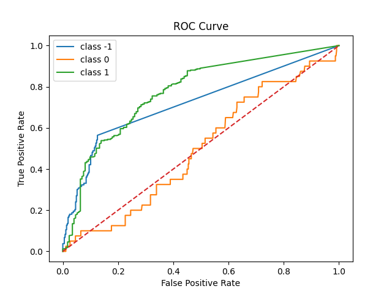
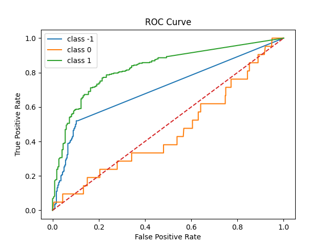

- [For Data Processing](#for-data-processing)
    - [This lexicon model does not require training; it is directly evaluated.](#this-lexicon-model-does-not-require-training-it-is-directly-evaluated)
    - [Problems with the data itself](#problems-with-the-data-itself)
    - [Problems with the model itself](#problems-with-the-model-itself)
    - [Tentative Conclusions](#tentative-conclusions)
- [How to run](#how-to-run)
    - [pip requirements](#pip-requirements)
    - [outputs](#outputs)
        - [source\_0 conclusion](#source_0-conclusion)
        - [source\_1 conclusion](#source_1-conclusion)


# For Data Processing

### This lexicon model does not require training; it is directly evaluated.

VADER Sentiment is essentially a lexicon + rule system with built-in sentiment scores (-4 ~ +4). It does not require training data, so it directly uses inference + evaluation.

Original data path: `./val/source_0/sft_val.json` and `./val/source_1/sft_val.json`

Based on the last part of the output field `\\boxed{positive}` or  `\\boxed{negative}` or `\\boxed{neutral}`为`positive = 1 neutral=0 negative= -1`

### Problems with the data itself

The classes are imbalanced (because Lexicon doesn't require training, I haven't looked at the training and validation set data, but the imbalance is evident from the test data alone):

The following only describes the test data (i.e., the data directly evaluated).

source_0
```
boxed{positive} 827
boxed{neutral} 40
boxed{negative} 133
```

source_1
```
boxed{positive} 781
boxed{neutral} 21
boxed{negative} 198
```

The output has been converted into two CSV files, containing `id,review,label,prediction`。

metrics:
```
Accuracy,
Precision, 
Recall, 
F1-score, 
Confusion matrix
ROC curve (ROC已直接出图)
AUC score 
```


### Problems with the model itself

VADER is a binary classification system, designed primarily for positive vs. negative, not for positive / neutral / negative.

Neutral ≈ close to 0, but in many sentences:
Slightly positive → is judged as positive
Slightly negative → is judged as negative

### Tentative Conclusions

Very strong for positive
Almost ineffective for neutral
Moderate for negative

Positive (Performs very well)

Precision ≈ 0.77

Recall ≈ 0.88

F1 ≈ 0.82

Negative (Moderate)

F1 ≈ 0.57 / 0.61 Can identify, but unstable. From the confusion matrix: [-1] → Many are predicted as positive

Neutral (Catastrophic)

F1 ≈ 0.04 / 0.06

Recall ≈ 0.02 ~ 0.04 Basically cannot identify neutral

AUC ≈ 0.6635 Note: Has some distinguishing ability but not strong.


# How to run

### pip requirements

    python.exe -m pip install vaderSentiment numpy scikit-learn matplotlib 

### outputs

##### source_0 conclusion

```
Saved results to result_source_0.csv

===== Evaluation =====
Accuracy: 0.7240
Precision (macro): 0.4987
Recall (macro): 0.4834
F1-score (macro): 0.4801

Classification Report:
              precision    recall  f1-score   support

          -1     0.6102    0.5414    0.5737       133
           0     0.1111    0.0250    0.0408        40
           1     0.7748    0.8838    0.8257       327

    accuracy                         0.7240       500
   macro avg     0.4987    0.4834    0.4801       500
weighted avg     0.6779    0.7240    0.6959       500


Confusion Matrix:
[[ 72   5  56]
 [ 11   1  28]
 [ 35   3 289]]

AUC (multi-class): 0.6635
ROC curve saved as roc_curve.png
```



##### source_1 conclusion

```
Saved results to result_source_1.csv

===== Evaluation =====
Accuracy: 0.7060
Precision (macro): 0.5245
Recall (macro): 0.4846
F1-score (macro): 0.4890

Classification Report:
              precision    recall  f1-score   support

          -1     0.7630    0.5202    0.6186       198
           0     0.1111    0.0476    0.0667        21
           1     0.6994    0.8861    0.7818       281

    accuracy                         0.7060       500
   macro avg     0.5245    0.4846    0.4890       500
weighted avg     0.6999    0.7060    0.6871       500


Confusion Matrix:
[[103   4  91]
 [  4   1  16]
 [ 28   4 249]]

AUC (multi-class): 0.6649
ROC curve saved as roc_curve.png
```




