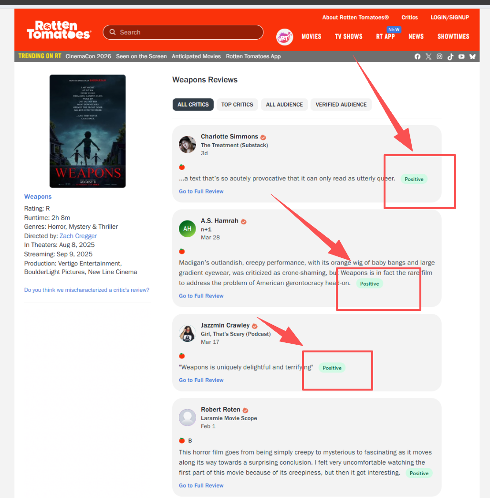
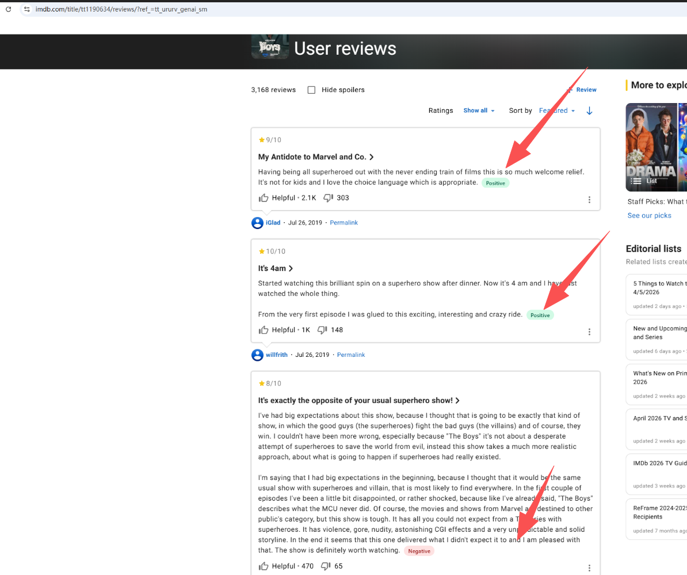
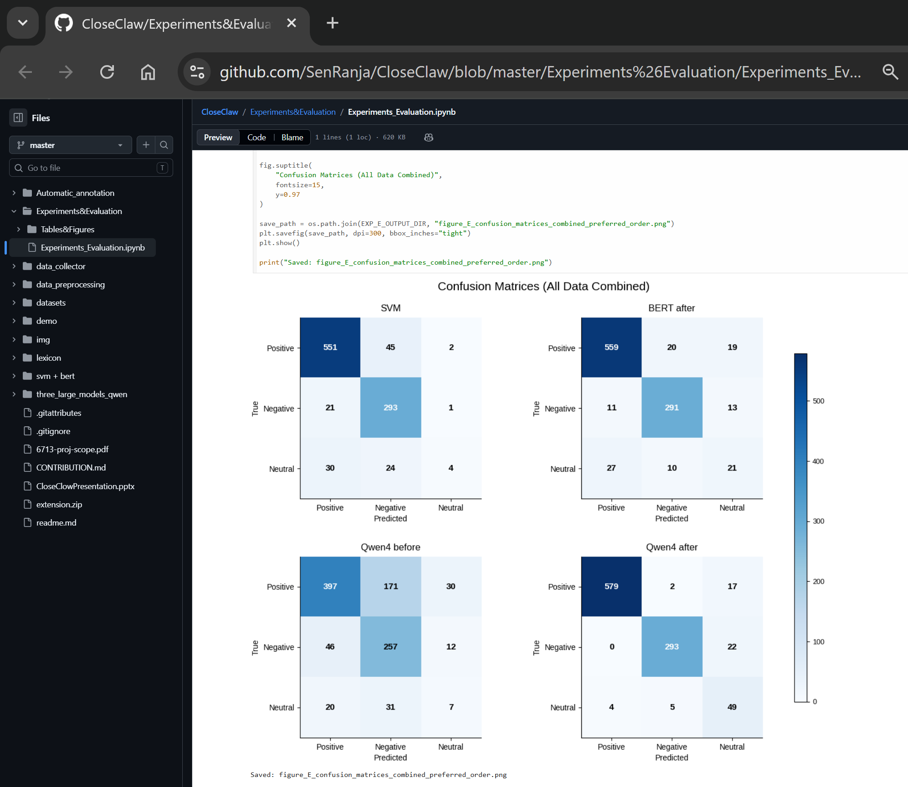

- [Demo for sentiment analysis of movie review](#demo-for-sentiment-analysis-of-movie-review)
- [Team CloseClaw and teammeates](#team-closeclaw-and-teammeates)
- [Reading Instructions](#reading-instructions)
- [our deliverables are downloadable](#our-deliverables-are-downloadable)
- [command run and result](#command-run-and-result)
- [Datasets](#datasets)
  - [Existing open-source data datasets](#existing-open-source-data-datasets)
  - [Self-built spider dataset](#self-built-spider-dataset)
- [Data analysis](#data-analysis)
  - [Length problem](#length-problem)
  - [Non-ASCII characters](#non-ascii-characters)
  - [Satirical comments](#satirical-comments)
  - [The centrists rated 5 or 6](#the-centrists-rated-5-or-6)
- [Preprocessing](#preprocessing)
  - [Requirement for the processed dataset](#requirement-for-the-processed-dataset)
    - [Definition of classification problem for the labels](#definition-of-classification-problem-for-the-labels)
    - [Definition of the source ID to distinguish dataset sources](#definition-of-the-source-id-to-distinguish-dataset-sources)
  - [Code](#code)
    - [1. Data\_preprocessing](#1-data_preprocessing)
    - [2. Relabel the data using a large model](#2-relabel-the-data-using-a-large-model)
  - [Training dataset \& test dataset](#training-dataset--test-dataset)
- [Models](#models)
  - [VADER (lexicon)](#vader-lexicon)
  - [SVM (baseline model)](#svm-baseline-model)
  - [BERT](#bert)
  - [Qwen3-0.6B, Qwen3-1.7B, Qwen3-4B](#qwen3-06b-qwen3-17b-qwen3-4b)
- [Experiments \& Evaluation](#experiments--evaluation)
- [Demo](#demo)
  - [Installation (QuickStart!) for Demo](#installation-quickstart-for-demo)
    - [1. Load the Extension](#1-load-the-extension)
    - [2. Verify the Connection](#2-verify-the-connection)
  - [Usage](#usage)
    - [Automatic Badge Labeling](#automatic-badge-labeling)
    - [Switching Models](#switching-models)


# Demo for sentiment analysis of movie review

Our demo is a **Chrome extension**, which automatically labels movie review sentiment on IMDb and Rotten Tomatoes, powered by fine-tuned Qwen3 models served from HuggingFace Spaces.

There is a Youtube Video, it shows the Demo: [ How to install extension & effect](https://youtu.be/8mZQOo3kle0)

For the detailed description, refer to the markdown of [Demo description](https://github.com/SenRanja/CloseClaw/blob/master/demo/Browser_Based_Sentiment_Visualization/7_system_interface.md).

It generates the website labels in websites of `IMDB` and `Rotten Tomatoes`.





# Team CloseClaw and teammeates

| Name | Zid |
|-----|-----|
| Kejing Wang   | z5526880 |
| Haotian Wang | z5576699 |
| Weiye Li | z5597115 |
| Yanjian Shen | z5541664 |
| Yingxin Li | z5519793 |

# Reading Instructions

Due to the large scale of this team project involving multiple collaborators, and also for readability reasons, the `code`, `how-to-run` `instructions`, and `explanations` **cannot be presented in a single Markdown document**. 

Readers are advised to **refer to the references** provided in this article. These references are specifically designed as **navigation** elements **within the project** for convenience.

# our deliverables are downloadable

For **code**, it is located in github repository: [github.com/SenRanja/CloseClaw](https://github.com/SenRanja/CloseClaw).

For **CONTRIBUTION.md**, refer to [CONTRIBUTION.md](https://github.com/SenRanja/CloseClaw/blob/master/CONTRIBUTION.md).

For **weight files for all fine-tuned models**, the downloadable links: [huggingface.co/alanwang2001](https://huggingface.co/alanwang2001).

For our **slides of presentation**, it's [presentation/CloseClowPresentation.pptx](https://github.com/SenRanja/CloseClaw/blob/master/presentation/CloseClowPresentation.pptx).

# command run and result

The result of our report (pdf) can be running command-line to acquire the result of the report.

The **run_direct_chat_1_7b.sh** is in [three_large_models_qwen/run_direct_chat_1_7b.sh](https://github.com/SenRanja/CloseClaw/blob/master/three_large_models_qwen/run_direct_chat_1_7b.sh).

Example command-line invocation.

```
bash run_direct_chat_1_7b.sh \--review "This movie is painfully slow, badly acted, and not worth watching."
```

Expected output.

```
The review clearly expresses a negative opinion about the movie, describing it as painfully slow and not worth watching.
```

This interface is useful for debugging, fast verification, and reproducible testing of individual samples without requiring a graphical user interface. For further to get specific `positive`, `negative` or `neutral`, we can use script to match the classfication.

# Datasets

## Existing open-source data datasets

1. [IMDB Large Movie Review Dataset (2011)](http://ai.stanford.edu/~amaas/data/sentiment/) (**100k rows**)

2. [cornell-movie-review-data/rotten_tomatoes](https://huggingface.co/datasets/cornell-movie-review-data/rotten_tomatoes) **(10.67k rows**)

## Self-built spider dataset

- IMDB latest movies

It is **different** from **IMDB Large Movie Review Dataset (2011)** mentioned in `existing datasets`.

We got **25,618 rows** from our spider.

For the spider code, plesae refer to the directory of [data_collector](https://github.com/SenRanja/CloseClaw/tree/master/data_collector). We drived **Chromedrive** to acquire the latest movie reviews. It used the `XPATH` to select the element of the movie reviews, just like the below XPATH:

```
//*[@id="__next"]/main/div/section/div/section/div/div[1]/section[1]/article[3]/div[1]/div[1]/div[1]/span/span[1]
//*[@id="__next"]/main/div/section/div/section/div/div[1]/section[1]/article[3]/div[1]/div[1]/div[3]/div/div/div
```

For the data

# Data analysis

## Length problem

For the best movie review input for later generic model training & evaluating, we want the **[20, 200]** words of the movie review.

Some reviews are too long for the large models, which account for about one third, even they are written well. Because our datasets contain already plenty items of movie reviews, we decided to aboundon these too long reviews directly.

## Non-ASCII characters

NLP Large Model can understand English and possibly other languages. But for this project task, we filtered the reviews containing non-ASCII characters for the purity, just like emoji, non-English characters.

They may be from the non-English speaking reviewers, for the examples:

```
González
trémula
7º
½
Sööt
7º
años
```

## Satirical comments

There are many sarcastic reviews in the datasets, just like the review look so good `Yes, it cannot be better any more`, literally we'd regard it as an optimistic review, but the reviewer gave **1** marks as the lowest mark.

In the future, for avoidance of large model to be confused, we will re-annotate the labels by the other three large models.

## The centrists rated 5 or 6

IMDB's rates is in [1, 10]. We used SQL to check the centrists of [4, 7]. Because they are not clear enough to show if they like or dislike the movie, later we'd consider use them. Because large models need to learn some necessary centrists reviews as the training data.

```
SELECT 
    rating,
    COUNT(*) AS cnt,
    ROUND(COUNT(*) * 100.0 / (SELECT COUNT(*) FROM reviews), 2) AS percent
FROM reviews
GROUP BY rating
ORDER BY rating;
```


# Preprocessing

## Requirement for the processed dataset

### Definition of classification problem for the labels

For our preprocessed datasets, we defined the classification labels: 

- **0** represents **neutral**
- **1** represents **positive**
- **-1** represents **negative**

### Definition of the source ID to distinguish dataset sources

For future to evaluate the datasets' quality (different from large models), we distinguish two types of the dataset sources: 

- **0** to represent open-source data: just like **IMDB Large Movie Review Dataset (2011)** and **rotten_tomatoes**
- **1** to represent self-built spider dataset: just like IMDB latest movies from our spider scripts.

## Code

### 1. Data_preprocessing

For the total datasets of ours, please refer to the **SQLite DB** file as below:

[datasets/cleaned_reviews.db](https://github.com/SenRanja/CloseClaw/blob/master/datasets/cleaned_reviews.db)

It is a SQLite DB, you can use **DBeaver** to connect the DB file easily. It contains simply filtered `62,136` original items.

SQL: `select count(*) from reviews`


The relative codes are in [data_preprocessing](https://github.com/SenRanja/CloseClaw/tree/master/data_preprocessing).

### 2. Relabel the data using a large model

Eventually for avoidance of Satirical comments, we used GPT-4o-mini (Annotator A) and Gemini 2.5 Flash (Annotator B) to re-label the dataset.

For this part of description, please refer to the markdown of [3_3_Annotation%20Process.md](https://github.com/SenRanja/CloseClaw/blob/master/Automatic_annotation/3_3_Annotation%20Process.md), it will introduce how we re-labelled the datasets.

For the code, refer to [Automatic_annotation/auto_label](https://github.com/SenRanja/CloseClaw/blob/master/Automatic_annotation/auto_label.py).

## Training dataset & test dataset

After preprocessing, we designed the formal training dataset & test dataset.

**Train & validate dataset**

[datasets/sft_train.json](https://github.com/SenRanja/CloseClaw/blob/master/datasets/sft_train.json)


**Test dataset**

[datasets/val](https://github.com/SenRanja/CloseClaw/tree/master/datasets/val)

(Because of some minor naming errors, the test dataset is named as `val`. Actually it is test data, which is used to evaluate our models.)

# Models

## VADER (lexicon)

As our project scope mentioned, we used **VADER**:

```
Valence Aware Dictionary and sEntiment Reasoner: https://github.com/cjhutto/vaderSentiment
it can get sentiment value from "[–4] Extremely Negative" to "[4] Extremely Positive", with allowance for "[0] Neutral. And we will make it simple as a binary labels.
```

For more description about `how to run`, and the `consequence with diagrams` of it, and the code of lexicon, please refer to the `readme.md`: [lexicon/readme.md](https://github.com/SenRanja/CloseClaw/blob/master/lexicon/readme.md)

The code and output and results after code execution are in [lexicon code & output](https://github.com/SenRanja/CloseClaw/tree/master/lexicon)

## SVM (baseline model)

For more description about SVM (our baseline model) & code, please refer to the link: [SVM/readme.md](https://github.com/SenRanja/CloseClaw/blob/master/svm%20%2B%20bert/svm%20%2B%20bert.md) and [SVM code & output](https://github.com/SenRanja/CloseClaw/tree/master/svm%20%2B%20bert/svm%20%2B%20bert/svm).


## BERT

For more description about BERT & code, please refer to the link: [BERT/readme.md](https://github.com/SenRanja/CloseClaw/blob/master/svm%20%2B%20bert/svm%20%2B%20bert.md) and [BERT code & output](https://github.com/SenRanja/CloseClaw/tree/master/svm%20%2B%20bert/svm%20%2B%20bert/bert).

## Qwen3-0.6B, Qwen3-1.7B, Qwen3-4B

We've run three large models of **Qwen3-0.6B**, **Qwen3-1.7B**, and **Qwen3-4B**. For the descriptions of them, refer to the directory: [Qwen](https://github.com/SenRanja/CloseClaw/tree/master/three_large_models_qwen), it is a big pipeline to run Qwen to generate the outputs by one teammate specially, hence its code style is different from the others above.

Please read the instructions if you want to know how it ran because of its complexity. There are some explanations for the code hierarchy:

For how to run the pipelines:

[QWEN_SFT_PIPELINE.md](https://github.com/SenRanja/CloseClaw/blob/master/three_large_models_qwen/QWEN_SFT_PIPELINE.md)

[agent_pipeline_learning_router.md](https://github.com/SenRanja/CloseClaw/blob/master/three_large_models_qwen/COMP6713_agent_pipeline_learning_router.md)

[industrial_sentiment_pipeline_3branch.md](https://github.com/SenRanja/CloseClaw/blob/master/three_large_models_qwen/COMP6713_industrial_sentiment_pipeline_3branch.md)

[modeling_pipeline_bert_qwen_dpo.md](https://github.com/SenRanja/CloseClaw/blob/master/three_large_models_qwen/COMP6713_modeling_pipeline_bert_qwen_dpo.md)

# Experiments & Evaluation

The final data integration, chart generation, and processing of the results after running **all the above models**, please refer to the executed Jupyter Notebook: [Experiments_Evaluation.ipynb](https://github.com/SenRanja/CloseClaw/blob/master/Experiments%26Evaluation/Experiments_Evaluation.ipynb), which contains all the outputed results of the total evaluations.

Besides, all the tables & figures are in [tables & figures](https://github.com/SenRanja/CloseClaw/tree/master/Experiments%26Evaluation/Tables%26Figures), just like that



# Demo

This section is to describe how to install as the video link (which is mentioned at the begining of this article): [ How to install extension & effect](https://youtu.be/8mZQOo3kle0)

Please note that the extension may not be in use in the future due to the DOM change of the movie review websites. But at least in April 23rd, it can still work normally.


## Installation (QuickStart!) for Demo

### 1. Load the Extension

0. Download the extension: [extension.zip](https://github.com/SenRanja/CloseClaw/blob/master/extension.zip), and then unzip it.
1. Open Chrome and navigate to `chrome://extensions/`
2. Enable **Developer mode** (toggle in the top-right corner)
3. Click **Load unpacked**
4. Select the `extension/` folder from this project

### 2. Verify the Connection

Click the extension icon in the Chrome toolbar. The status dot should turn green and show **"Server online"**. If it shows offline, the HuggingFace Space may be sleeping — wait 30 seconds and try again.

---

## Usage

### Automatic Badge Labeling

1. Navigate to any supported movie review page (IMDb or Rotten Tomatoes)
2. The extension automatically scans reviews and injects sentiment badges
3. Each badge shows one of three labels:
   - **Positive** — reviewer has a favorable opinion
   - **Negative** — reviewer has an unfavorable opinion
   - **Neutral** — mixed or balanced opinion
4. Hover over a badge to see the model's reasoning

### Switching Models

1. Click the extension icon to open the popup
2. Select a model from the list:
   - **Qwen3-0.6B** — faster, lighter
   - **Qwen3-1.7B** — more accurate, slower
3. Click **Apply** and wait up to 30 seconds for the model to switch


