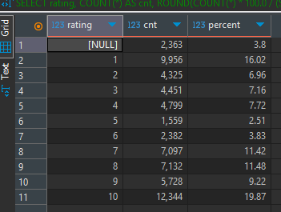
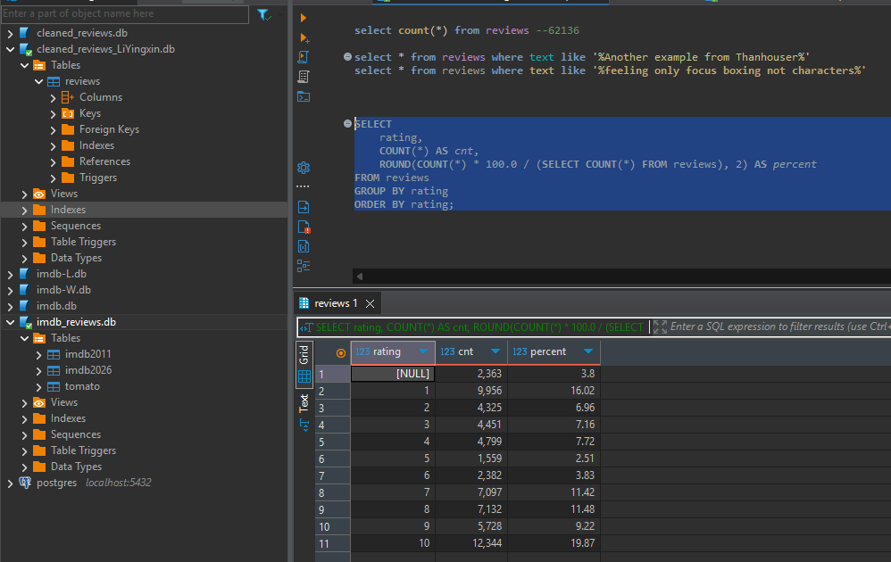
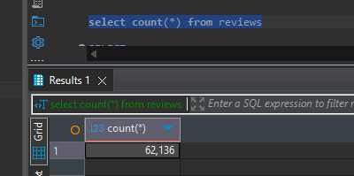
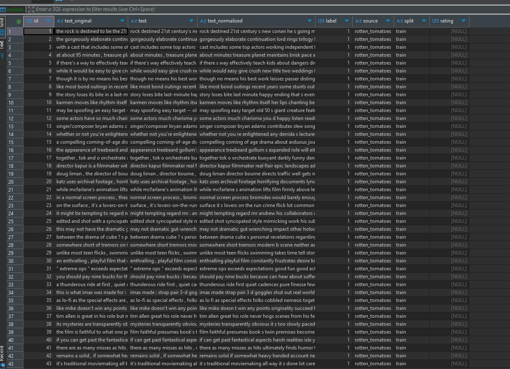

- [datasets](#datasets)
  - [existing open-source data datasets](#existing-open-source-data-datasets)
  - [self-built spider dataset](#self-built-spider-dataset)
- [data analysis](#data-analysis)
  - [Length problem](#length-problem)
  - [Non-ASCII characters](#non-ascii-characters)
  - [Satirical comments](#satirical-comments)
  - [The centrists rated 5 or 6](#the-centrists-rated-5-or-6)
- [preprocessing](#preprocessing)
  - [requirement for the processed dataset](#requirement-for-the-processed-dataset)
    - [definition of classification problem for the labels](#definition-of-classification-problem-for-the-labels)
    - [definition of the source ID to distinguish dataset sources](#definition-of-the-source-id-to-distinguish-dataset-sources)
  - [code](#code)
    - [1. data\_preprocessing](#1-data_preprocessing)
    - [2. Relabel the data using a large model](#2-relabel-the-data-using-a-large-model)
  - [training dataset \& test dataset](#training-dataset--test-dataset)

# datasets

## existing open-source data datasets

1. [IMDB Large Movie Review Dataset (2011)](http://ai.stanford.edu/~amaas/data/sentiment/) (**100k rows**)

2. [cornell-movie-review-data/rotten_tomatoes](https://huggingface.co/datasets/cornell-movie-review-data/rotten_tomatoes) **(10.67k rows**)

## self-built spider dataset

- IMDB latest movies

It is **different** from **IMDB Large Movie Review Dataset (2011)** mentioned in `existing datasets`.

We got **25,618 rows** from our spider.

For the spider code, plesae refer to `data_collector`. We drived **Chromedrive** to acquire the latest movie reviews. It used the `XPATH` to select the element of the movie reviews, just like the below XPATH:

```
//*[@id="__next"]/main/div/section/div/section/div/div[1]/section[1]/article[3]/div[1]/div[1]/div[1]/span/span[1]
//*[@id="__next"]/main/div/section/div/section/div/div[1]/section[1]/article[3]/div[1]/div[1]/div[3]/div/div/div
```

For the data

# data analysis

## Length problem

For the best movie review input for later generic model training & evaluating, we want the **[20, 200]** words of the movie review.

Some reviews are too long for the large models, which account for about one third, even they are written well. Because our datasets contain already plenty items of movie reviews, we decided to aboundon these too long reviews directly.

## Non-ASCII characters

NLP Large Model can understand English and possibly other languages. But for this project task, we filtered the reviews containing non-ASCII characters for the purity, just like emoji, non-English characters.

They may be from the non-English speaking reviewers, for the examples:

```
González
trémula
7º
½
Sööt
7º
años
```

## Satirical comments

There are many sarcastic reviews in the datasets, just like the review look so good `Yes, it cannot be better any more`, literally we'd regard it as an optimistic review, but the reviewer gave **1** marks as the lowest mark.

In the future, for avoidance of large model to be confused, we will re-annotate the labels by the other three large models.

## The centrists rated 5 or 6

IMDB's rates is in [1, 10]. We used SQL to check the centrists of [4, 7]. Because they are not clear enough to show if they like or dislike the movie, later we'd consider use them. Because large models need to learn some necessary centrists reviews as the training data.

```
SELECT 
    rating,
    COUNT(*) AS cnt,
    ROUND(COUNT(*) * 100.0 / (SELECT COUNT(*) FROM reviews), 2) AS percent
FROM reviews
GROUP BY rating
ORDER BY rating;
```





# preprocessing

## requirement for the processed dataset

### definition of classification problem for the labels

For our preprocessed datasets, we defined the classification labels: 

- **0** represents **neutral**
- **1** represents **positive**
- **-1** represents **negative**

### definition of the source ID to distinguish dataset sources

For future to evaluate the datasets' quality (different from large models), we distinguish two types of the dataset sources: 

- **0** to represent open-source data: just like **IMDB Large Movie Review Dataset (2011)** and **rotten_tomatoes**
- **1** to represent self-built spider dataset: just like IMDB latest movies from our spider scripts.

## code

### 1. data_preprocessing

For the total datasets of ours, please refer to the **SQLite DB** as below:

[datasets/cleaned_reviews.db](https://github.com/SenRanja/CloseClaw/blob/master/datasets/cleaned_reviews.db)

It is a SQLite DB, you can use **DBeaver** to connect the DB file easily. It contains simply filtered `62,136` original items.

SQL: `select count(*) from reviews`





### 2. Relabel the data using a large model

Eventually for avoidance of Satirical comments, we used GPT-4o-mini (Annotator A) and Gemini 2.5 Flash (Annotator B) to re-label the dataset.

For this part of description, please refer to [3_3_Annotation%20Process.md](https://github.com/SenRanja/CloseClaw/blob/master/Automatic_annotation/3_3_Annotation%20Process.md), it will introduce how we re-labelled the datasets.

For the code, refer to [Automatic_annotation/auto_label](https://github.com/SenRanja/CloseClaw/blob/master/Automatic_annotation/auto_label.py).

## training dataset & test dataset

After preprocessing, we designed the formal training dataset & test dataset.

**train & validate dataset**

[datasets/sft_train.json](https://github.com/SenRanja/CloseClaw/blob/master/datasets/sft_train.json)


**test dataset**

[datasets/val](https://github.com/SenRanja/CloseClaw/tree/master/datasets/val)

(Because of some minor naming errors, the test dataset is named as `val`. Actually it is test data, which is used to evaluate our models.)


